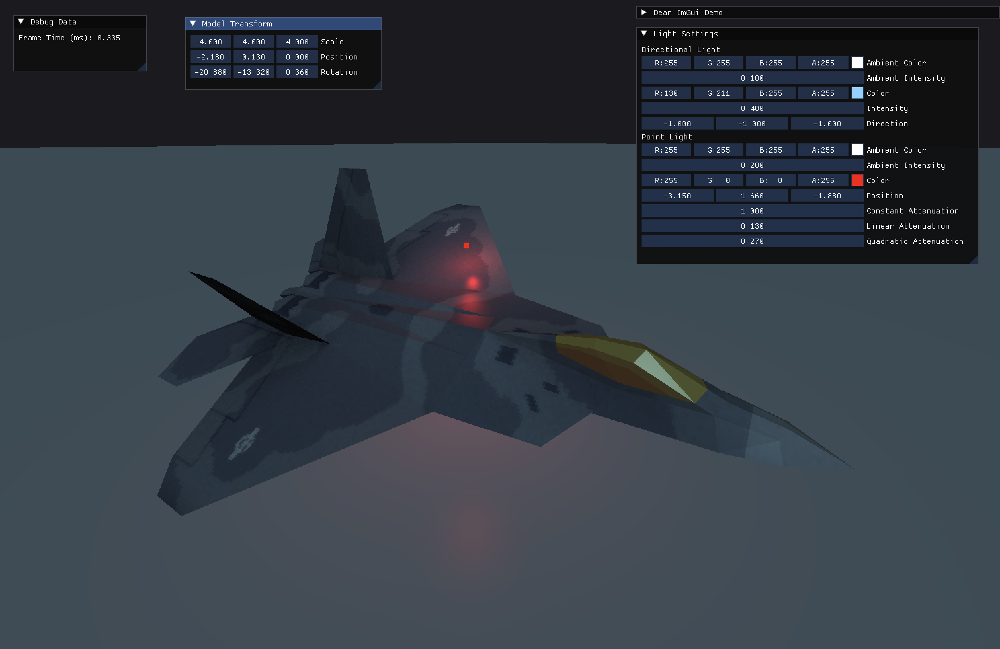

<!-- [![header][header-url]][header-link] -->

# Noether

> Noether is a C++ and OpenGL based Renderer, Physics Engine, and Game Framework.

## Features

* Rendering
  * Model loading form .obj wavefront files.
  * Shader loading from file.
  * Material system.
  * Directional and point lighting using the Phong reflection model.
  * MSAA.
  * Skyboxes.
  * Shadow Mapping for Directional Lights.

* General
  * Event & polling based input abstractions.
  * Variable frame-rate game loop with high-precision timing.
  * ImGUI drawing capability, easily accessible from client code.

Noether is built with cross-platform compatibility in mind. Although it currently only supports MacOS with an OpenGL rendering backend right now, the codebase is structured is such a way as to allow for easy addition of platforms in the future.

## Installation

As of right now, this project only builds on MacOS. To get started just clone the repo and run premake5 gmake on the root directory. For font rendering you will need to have freetype installed somewhere on your system path.

## Built With

* [GLFW](https://www.glfw.org/) - Desktop Platform Independant Windowing
* [DearIMGUI](https://github.com/ocornut/imgui) - Immediate-Mode GUI
